# Solucions dels Algorítmes

Crea el pseudocódi i el ordinograma de cada un dels exercicis propostos.

## Exercici 1

La empresa Hotel XYZ ha sol·licitat un programa que, al moment d'entrar els hostes al lobby, s'executi automàticament en una pantalla de benvinguda i mostre el missatge "Bon dia" als clients en castellà. Necessitem un algoritme que permeta mostrar aquest missatge en la pantalla. Més endavant, podrem integrar-lo amb un sistema de detecció de moviment.

```pseudocódigo
Inici
    Escriure "Buenos días"
Fi
```

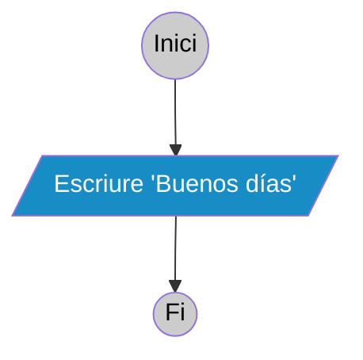
```mermaid
graph TD
    A((Inici)) --> B[/Escriure 'Buenos días'/]
    B --> C((Fi))

    classDef romboide fill:#188CC4, color:white;
    classDef inici_fi fill:#ccc, color:#000;
    class B romboide
    class A,C inici_fi
```

---

## Exercici 2

L'empresa Arquitectura Verde necessita un programa per calcular automàticament l’àrea d’un quadrat amb un costat de longitud fixa, igual a 5 metres. Aquest càlcul s’utilitzarà en el seu programari de disseny per estimar superfícies d’estructures xicotetes. Necessiten que el programa mostre l’àrea en metres quadrats quan s’execute.

```pseudocódigo
Inici
    costat ← 5
    àrea ← costat * costat
    Escriure "L’àrea del quadrat és:", àrea, "m²"
Fi
```

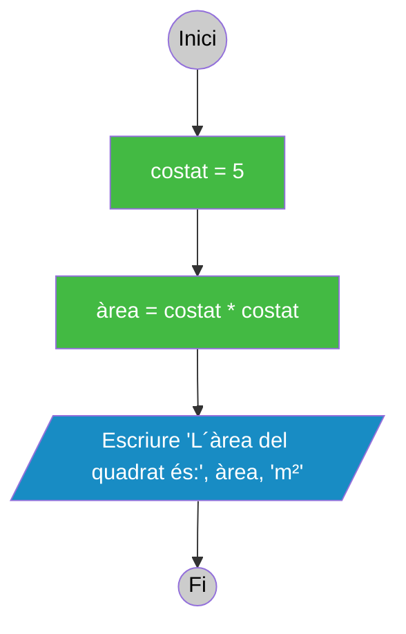
```mermaid
graph TD
    A((Inici)) --> B[costat = 5]
    B --> C[àrea = costat * costat]
    C --> D[/Escriure 'L´àrea del quadrat és:', àrea, 'm²'/]
    D --> E((Fi))

    classDef romboide fill:#188CC4, color:white;
    classDef rectangle fill:#43BA43, color:white;
    classDef inici_fi fill:#ccc, color:#000;
    class D romboide
    class B,C rectangle
    class A,E inici_fi
```

---

## Exercici 3

La botiga Ferreteria Global vol un sistema en el qual els empleats puguen introduir la longitud del costat d’un quadrat per calcular la seua àrea. Aquest programa els ajudarà a estimar la quantitat de material necessària per construir plataformes quadrades de diferents mides. El costat serà introduït per teclat, i el programa ha de retornar l’àrea en metres quadrats.

```pseudocódigo
Inici
    Escriure "Introduïu el valor del costat del quadrat:"
    Llegir costat
    àrea ← costat * costat
    Escriure "L’àrea del quadrat és:", àrea, "m²"
Fi
```

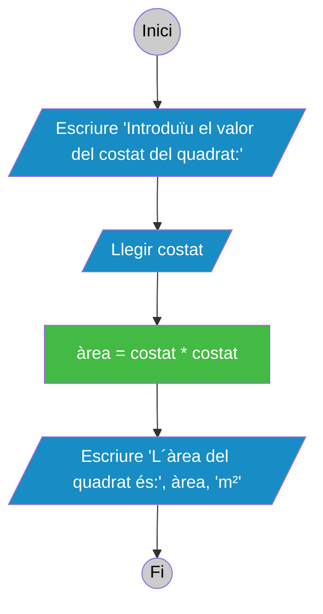
```mermaid
graph TD
    A((Inici)) --> B[/Escriure 'Introduïu el valor del costat del quadrat:'/]
    B --> C[/Llegir costat/]
    C --> D[àrea = costat * costat]
    D --> E[/Escriure 'L´àrea del quadrat és:', àrea, 'm²'/]
    E --> F((Fi))

    classDef romboide fill:#188CC4, color:white;
    classDef rombo fill:#A08DB1, color:white;
    classDef rectangle fill:#43BA43, color:white;
    classDef inici_fi fill:#ccc, color:#000;
    class B,C,E romboide
    class D rectangle
    class A,F inici_fi
```

---

## Exercici 4

L'empresa Comptabilitat i Finances S.A. ha sol·licitat un programa que permeti als seus comptables introduir dos números i, en base a aquests, realitzar operacions bàsiques (suma, resta, multiplicació i divisió). Aquest programa s'utilitzarà per fer càlculs ràpids durant la revisió de balances financers. Els resultats han de mostrar-se immediatament després que s'introduïsquen els números.

```pseudocódigo
Inici
    Escriure "Introduïu el primer número:"
    Llegir num1
    Escriure "Introduïu el segon número:"
    Llegir num2
    suma ← num1 + num2
    resta ← num1 - num2
    producte ← num1 * num2
    si num2 ≠ 0 llavors
        divisió ← num1 / num2
    si no
        Escriure "Error: Divisió per zero"
    FiSi
    Escriure "Suma:", suma
    Escriure "Resta:", resta
    Escriure "Producte:", producte
    si num2 ≠ 0 llavors
        Escriure "Divisió:", divisió
    FiSi
Fi

```

  ```mermaid
graph TD
    A((Inici)) --> B[/Escriure 'Introduïu el primer número:'/]
    B --> C[/Llegir num1/]
    C --> D[/Escriure 'Introduïu el segon número:'/]
    D --> E[/Llegir num2/]
    E --> F[suma = num1 + num2]
    F --> G[resta = num1 - num2]
    G --> H[producte = num1 * num2]
    H --> I{num2 ≠ 0}
    I -->|Sí| J[divisió = num1 / num2]
    I -->|No| K[/Escriure 'Error: Divisió per zero'/]
    J --> L[/Escriure 'Suma:', suma/]
    K --> L
    L --> M[/Escriure 'Resta:', resta/]
    M --> N[/Escriure 'Producte:', producte/]
    N --> O{num2 ≠ 0}
    O -->|Sí| P[/Escriure 'Divisió:', divisió/]
    O -->|No| Q((Fi))
    P --> Q

    classDef romboide fill:#188CC4, color:white;
    classDef rombo fill:#A08DB1, color:white;
    classDef rectangle fill:#43BA43, color:white;
    classDef inici_fi fill:#ccc, color:#000;
    class B,C,D,E,K,L,M,N,P romboide
    class F,G,H,J rectangle
    class I,O rombo
    class A,Q inici_fi

```

---

## Exercici 5

L'empresa Enginyeria Espacial Orbital necessita un programa que permeti calcular la longitud de la circumferència, l’àrea d’un cercle i el volum d’una esfera, donat el radi que serà introduït pels enginyers. Aquest càlcul s’utilitza per modelar diferents components esfèrics en satèl·lits, per la qual cosa el programa ha de ser el més precís possible.

```pseudocódigo
Inici
    Escriure "Introduïu el radi:"
    Llegir radi
    circumferència ← 2 * π * radi
    àrea ← π * radi^2
    volum ← (4/3) * π * radi^3
    Escriure "Circumferència:", circumferència
    Escriure "Àrea del cercle:", àrea
    Escriure "Volum de l'esfera:", volum
Fi

```

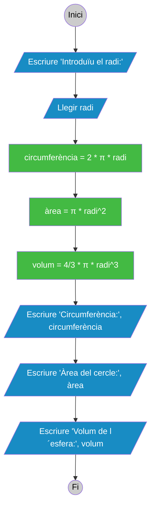
```mermaid
graph TD
    A((Inici)) --> B[/Escriure 'Introduïu el radi:'/]
    B --> C[/Llegir radi/]
    C --> D[circumferència = 2 * π * radi]
    D --> E[àrea = π * radi^2]
    E --> F[volum = 4/3 * π * radi^3]
    F --> G[/Escriure 'Circumferència:', circumferència/]
    G --> H[/Escriure 'Àrea del cercle:', àrea/]
    H --> I[/Escriure 'Volum de l´esfera:', volum/]
    I --> J((Fi))

    classDef romboide fill:#188CC4, color:white;
    classDef rombo fill:#A08DB1, color:white;
    classDef rectangle fill:#43BA43, color:white;
    classDef inici_fi fill:#ccc, color:#000;
    class B,C,G,H,I romboide
    class D,E,F rectangle
    class A,J inici_fi
```

---

## Exercici 6

La botiga Electrònica Modern desitja implementar un sistema que mostre el percentatge de descompte aplicat a un article. Els clients han de veure la diferència entre el preu original i el preu de venda. Aquest sistema es mostrarà en les pantalles del punt de venda quan s’aplique un descompte als productes.

```pseudocódigo
Inici
    Escriure "Introduïu el preu original:"
    Llegir preu_original
    Escriure "Introduïu el preu de venda:"
    Llegir preu_venta
    descompte ← ((preu_original - preu_venta) / preu_original) * 100
    Escriure "El descompte aplicat és:", descompte, "%"
Fi
```

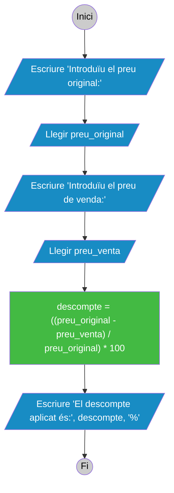
```mermaid
graph TD
    A((Inici)) --> B[/Escriure 'Introduïu el preu original:'/]
    B --> C[/Llegir preu_original/]
    C --> D[/Escriure 'Introduïu el preu de venda:'/]
    D --> E[/Llegir preu_venta/]
    E --> F["descompte = ((preu_original - preu_venta) / preu_original) * 100"]
    F --> G[/Escriure 'El descompte aplicat és:', descompte, '%'/]
    G --> H((Fi))

    classDef romboide fill:#188CC4, color:white;
    classDef rombo fill:#A08DB1, color:white;
    classDef rectangle fill:#43BA43, color:white;
    classDef inici_fi fill:#ccc, color:#000;
    class B,C,D,E,G romboide
    class F rectangle
    class A,H inici_fi
```

---

## Exercici 7

L'empresa Navegació Global sol·licita un programa que permeti als seus capitans convertir distàncies en milles marines a metres (una milla marina equival a 1.852 metres). Aquest sistema s’utilitzarà en la navegació d’embarcacions per calcular distàncies en unitats més comprensibles en situacions on es requereixen mesures en metres.

```pseudocódigo
Inici
    Escriure "Introduïu la distància en milles marines:"
    Llegir milles_marines
    metres ← milles_marines * 1852
    Escriure "La distància en metres és:", metres
Fi

```

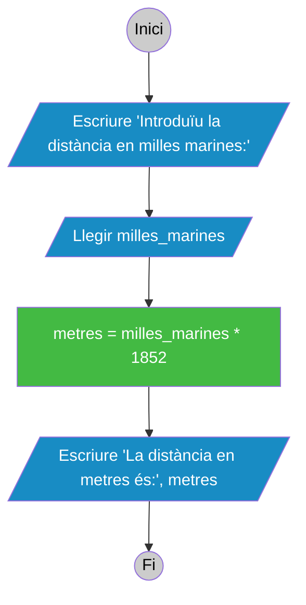
```mermaid
graph TD
    A((Inici)) --> B[/Escriure 'Introduïu la distància en milles marines:'/]
    B --> C[/Llegir milles_marines/]
    C --> D[metres = milles_marines * 1852]
    D --> E[/Escriure 'La distància en metres és:', metres/]
    E --> F((Fi))

    classDef romboide fill:#188CC4, color:white;
    classDef rombo fill:#A08DB1, color:white;
    classDef rectangle fill:#43BA43, color:white;
    classDef inici_fi fill:#ccc, color:#000;
    class B,C,E romboide
    class D rectangle
    class A,F inici_fi
```

---

## Exercici 8

L'empresa Segur Vida Feliç requereix un programa que determine si una persona és major o menor d'edat, ja que han de verificar ràpidament si un client és elegible per a certs serveis que només s'ofereixen a persones majors de 18 anys. El programa sol·licitarà l'edat i mostrarà el missatge corresponent.

```pseudocódigo
Inici
    Escriure "Introduïu la vostra edat:"
    Llegir edat
    Si edat >= 18 llavors
        Escriure "Eres major d'edat"
    Sinó
        Escriure "Eres menor d'edat"
    FiSi
Fi

```

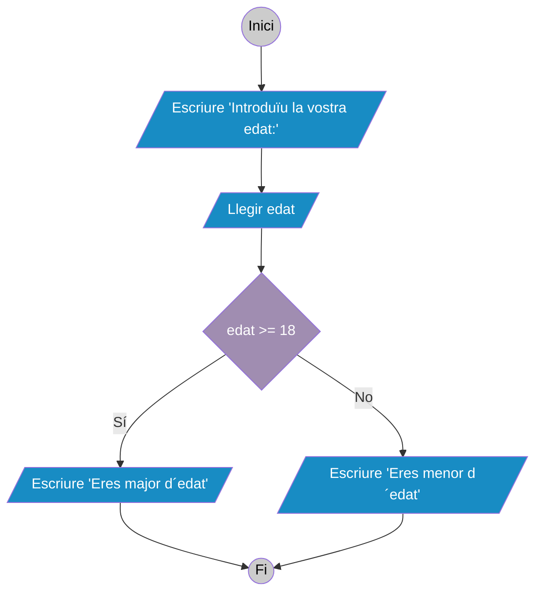
```mermaid
graph TD
    A((Inici)) --> B[/Escriure 'Introduïu la vostra edat:'/]
    B --> C[/Llegir edat/]
    C --> D{edat >= 18}
    D -->|Sí| E[/Escriure 'Eres major d´edat'/]
    D -->|No| F[/Escriure 'Eres menor d´edat'/]
    E --> G((Fi))
    F --> G

    classDef romboide fill:#188CC4, color:white;
    classDef rombo fill:#A08DB1, color:white;
    classDef rectangle fill:#43BA43, color:white;
    classDef inici_fi fill:#ccc, color:#000;
    class B,C,E,F romboide
    class D rombo
    class A,G inici_fi
```

---

## Exercici 9

L'empresa Dades i Càlculs Avançats S.L. necessita un programa que permeti comparar dos números i mostrar els valors en ordre ascendent. Aquest programa s'utilitzarà en el seu programari de processament de dades numèriques. Els empleats introduiran dos números, i el sistema haurà de mostrar-los de menor a major.

```pseudocódigo
Inici
    Escriure "Introduïu el primer número:"
    Llegir num1
    Escriure "Introduïu el segon número:"
    Llegir num2
    Si num1 < num2 llavors
        Escriure num1, num2
    Sinó
        Escriure num2, num1
    FiSi
Fi

```

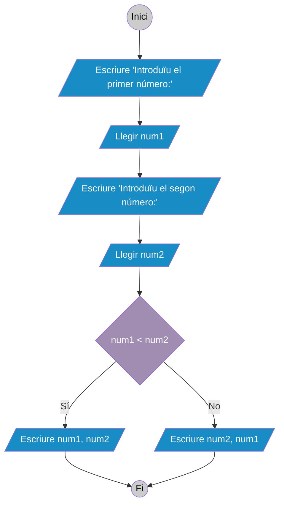
```mermaid
graph TD
    A((Inici)) --> B[/Escriure 'Introduïu el primer número:'/]
    B --> C[/Llegir num1/]
    C --> D[/Escriure 'Introduïu el segon número:'/]
    D --> E[/Llegir num2/]
    E --> F{num1 < num2}
    F -->|Sí| G[/Escriure num1, num2/]
    F -->|No| H[/Escriure num2, num1/]
    G --> I((Fi))
    H --> I

    classDef romboide fill:#188CC4, color:white;
    classDef rombo fill:#A08DB1, color:white;
    classDef rectangle fill:#43BA43, color:white;
    classDef inici_fi fill:#ccc, color:#000;
    class B,C,D,E,G,H romboide
    class F rombo
    class A,I inici_fi
```

---

## Exercici 10

L'institut Educació 4.0 sol·licita un programa que permeti convertir qualificacions numèriques en qualificacions alfabètiques. Aquest programa serà utilitzat pels professors per introduir les notes dels estudiants i classificar-les automàticament segons un sistema de qualificacions predefinit.

- 0 a <3: Molt Deficient
- 3 a <5: Insuficient
- 5 a <6: Bé
- 6 a <9: Notable
- 9 a 10: Excel·lent

```pseudocódigo
Inici
    Escriure "Introduïu una qualificació entre 0 i 10:"
    Llegir qualificació
    Si qualificació < 3 llavors
        Escriure "Molt Deficient"
    Sinó si qualificació >= 3 i qualificació < 5 llavors
        Escriure "Insuficient"
    Sinó si qualificació >= 5 i qualificació < 6 llavors
        Escriure "Bé"
    Sinó si qualificació >= 6 i qualificació < 9 llavors
        Escriure "Notable"
    Sinó
        Escriure "Excel·lent"
    FiSi
Fi

```

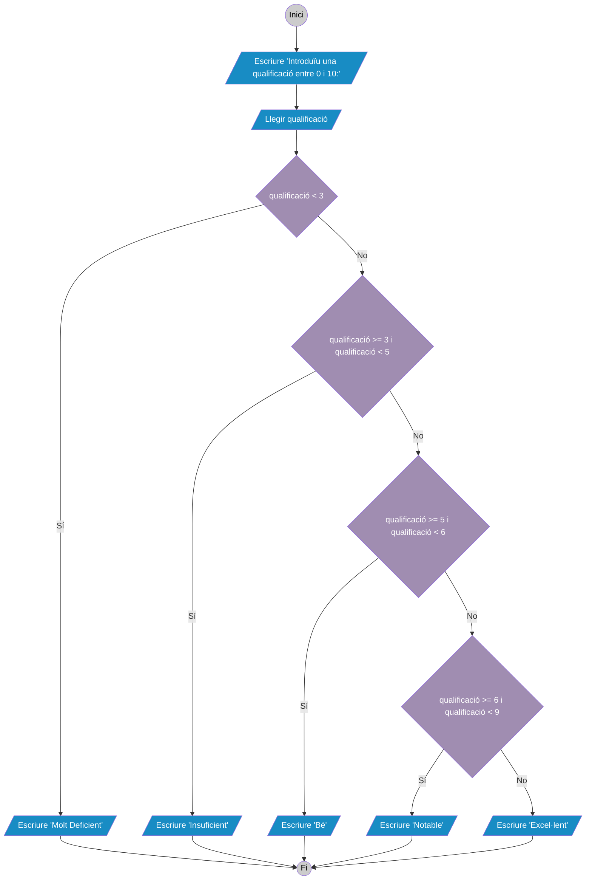
```mermaid
graph TD
    A((Inici)) --> B[/Escriure 'Introduïu una qualificació entre 0 i 10:'/]
    B --> C[/Llegir qualificació/]
    C --> D{qualificació < 3}
    D -->|Sí| E[/Escriure 'Molt Deficient'/]
    D -->|No| F{qualificació >= 3 i qualificació < 5}
    F -->|Sí| G[/Escriure 'Insuficient'/]
    F -->|No| H{qualificació >= 5 i qualificació < 6}
    H -->|Sí| I[/Escriure 'Bé'/]
    H -->|No| J{qualificació >= 6 i qualificació < 9}
    J -->|Sí| K[/Escriure 'Notable'/]
    J -->|No| L[/Escriure 'Excel·lent'/]
    E --> M((Fi))
    G --> M
    I --> M
    K --> M
    L --> M

    classDef romboide fill:#188CC4, color:white;
    classDef rombo fill:#A08DB1, color:white;
    classDef rectangle fill:#43BA43, color:white;
    classDef inici_fi fill:#ccc, color:#000;
    class B,C,E,G,I,K,L romboide
    class D,F,H,J rombo
    class A,M inici_fi

```

---

## Exercici 11

L'empresa Anàlisi Matemàtica Pro necessita un programa que calcule el factorial d'un número donat per l'usuari. Aquest programa s'utilitzarà per realitzar càlculs en investigacions matemàtiques i financeres, on es necessiten càlculs combinatoris i de probabilitat. El número serà introduït per l'usuari i es calcularà el seu factorial.

```pseudocódigo
Inici
    Escriure "Introduïu un número positiu N:"
    Llegir N
    factorial ← 1
    Per i des de 1 fins a N fer
        factorial ← factorial * i
    FiPer
    Escriure "El factorial de", N, "és:", factorial
Fi

```

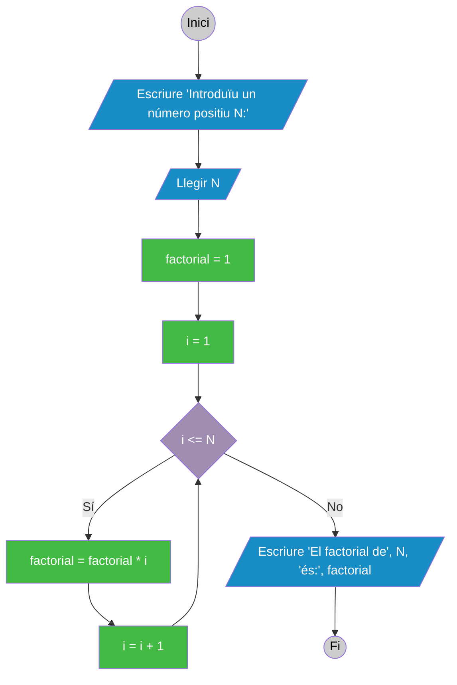
```mermaid
graph TD
    A((Inici)) --> B[/Escriure 'Introduïu un número positiu N:'/]
    B --> C[/Llegir N/]
    C --> D[factorial = 1]
    D --> E[i = 1]
    E --> F{i <= N}
    F -->|Sí| G[factorial = factorial * i]
    G --> H[i = i + 1]
    H --> F
    F -->|No| I[/Escriure 'El factorial de', N, 'és:', factorial/]
    I --> J((Fi))

    classDef romboide fill:#188CC4, color:white;
    classDef rombo fill:#A08DB1, color:white;
    classDef rectangle fill:#43BA43, color:white;
    classDef inici_fi fill:#ccc, color:#000;
    class B,C,I romboide
    class D,E,G,H rectangle
    class F rombo
    class A,J inici_fi

```

---

## Exercici 12

L'empresa Formació Didàctica ha sol·licitat un programa que mostre els primers 20 números naturals. Aquest sistema s’utilitzarà com a part dels seus cursos d'introducció a la programació i matemàtiques, on els estudiants poden observar com es fan servir els bucles per comptar.

```pseudocódigo
Inici
    Per i des de 1 fins a 20 fer
        Escriure i
    FiPer
Fi
```

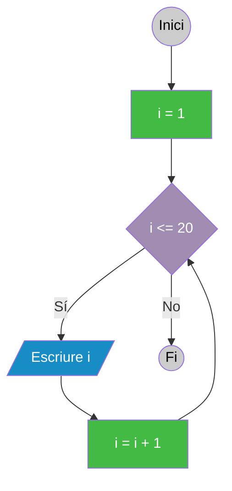
```mermaid
graph TD
    A((Inici)) --> B[i = 1]
    B --> C{i <= 20}
    C -->|Sí| D[/Escriure i/]
    D --> E[i = i + 1]
    E --> C
    C -->|No| F((Fi))

    classDef romboide fill:#188CC4, color:white;
    classDef rombo fill:#A08DB1, color:white;
    classDef rectangle fill:#43BA43, color:white;
    classDef inici_fi fill:#ccc, color:#000;
    class D romboide
    class B,E rectangle
    class C rombo
    class A,F inici_fi

```

---

## Exercici 13

El club esportiu Força Física necessita un programa que mostre tots els números parells des del 1 fins al 200 per ser utilitzat com a part dels exercicis mentals dels atletes. El programa ha de mostrar els números incrementant de 2 en 2.

```pseudocódigo
Inici
    Per i des de 2 fins a 200 fer
        Si i és parell llavors
            Escriure i
        FiSi
    FiPer
Fi

```

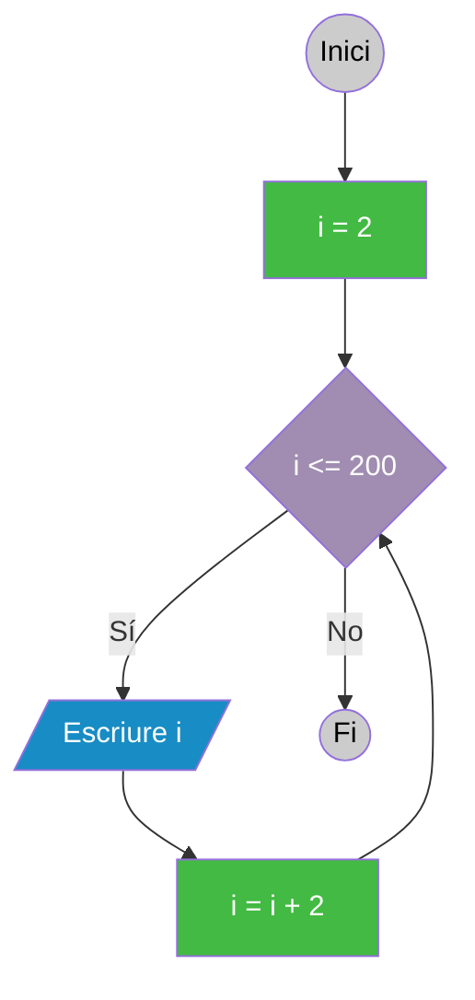
```mermaid
graph TD
    A((Inici)) --> B[i = 2]
    B --> C{i <= 200}
    C -->|Sí| D[/Escriure i/]
    D --> E[i = i + 2]
    E --> C
    C -->|No| F((Fi))

    classDef romboide fill:#188CC4, color:white;
    classDef rombo fill:#A08DB1, color:white;
    classDef rectangle fill:#43BA43, color:white;
    classDef inici_fi fill:#ccc, color:#000;
    class D romboide
    class B,E rectangle
    class C rombo
    class A,F inici_fi

```

---

## Exercici 14

L'organització Educació Infantil Plus requereix un programa que permeti introduir un número N i mostrar a la pantalla tots els números des de 1 fins a N. Això servirà com a eina didàctica per a l'ensenyament de números a nens.

```pseudocódigo
Inici
    Escriure "Introduïu un número N:"
    Llegir N
    Per i des de 1 fins a N fer
        Escriure i
    FiPer
Fi

```

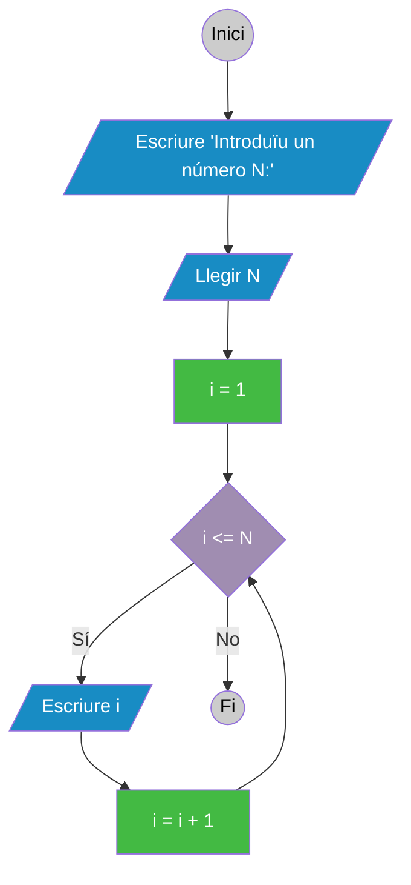
```mermaid
graph TD
    A((Inici)) --> B[/Escriure 'Introduïu un número N:'/]
    B --> C[/Llegir N/]
    C --> D[i = 1]
    D --> E{i <= N}
    E -->|Sí| F[/Escriure i/]
    F --> G[i = i + 1]
    G --> E
    E -->|No| H((Fi))

    classDef romboide fill:#188CC4, color:white;
    classDef rombo fill:#A08DB1, color:white;
    classDef rectangle fill:#43BA43, color:white;
    classDef inici_fi fill:#ccc, color:#000;
    class B,C,F romboide
    class D,G rectangle
    class E rombo
    class A,H inici_fi

```

---

## Exercici 15

La consultora Estadístiques Globals necessita un programa que permeti llegir 100 números introduïts per l'usuari i, si algun d'aquests és negatiu, el programa ha de notificar que s'ha introduït un número negatiu. Això s'utilitzarà per identificar entrades incorrectes durant el processament de grans lots de dades.

```pseudocódigo
Inici
    contador_negatius ← 0
    Per i des de 1 fins a 100 fer
        Escriure "Introduïu un número:"
        Llegir num
        Si num < 0 llavors
            contador_negatius ← contador_negatius + 1
        FiSi
    FiPer
    Si contador_negatius > 0 llavors
        Escriure "S'ha introduït almenys un número negatiu."
    Sinó
        Escriure "No s'han introduït números negatius."
    FiSi
Fi
```

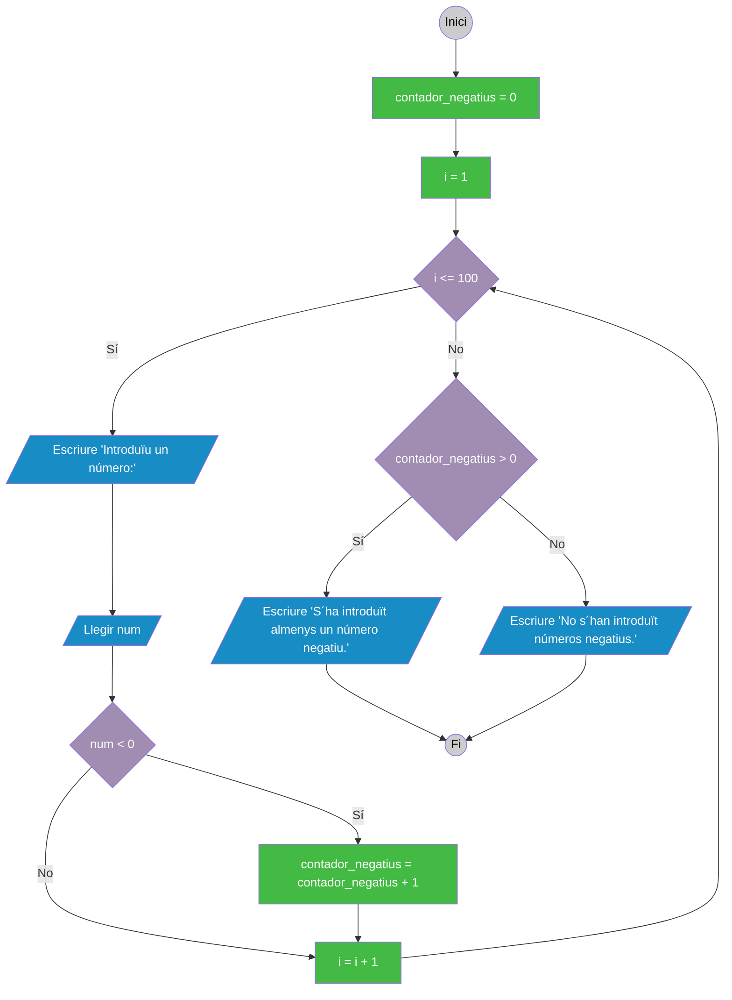
```mermaid
graph TD
    A((Inici)) --> B[contador_negatius = 0]
    B --> C[i = 1]
    C --> D{i <= 100}
    D -->|Sí| E[/Escriure 'Introduïu un número:'/]
    E --> F[/Llegir num/]
    F --> G{num < 0}
    G -->|Sí| H[contador_negatius = contador_negatius + 1]
    G -->|No| I[i = i + 1]
    H --> I
    I --> D
    D -->|No| J{contador_negatius > 0}
    J -->|Sí| K[/Escriure 'S´ha introduït almenys un número negatiu.'/]
    J -->|No| L[/Escriure 'No s´han introduït números negatius.'/]
    K --> M((Fi))
    L --> M

    classDef romboide fill:#188CC4, color:white;
    classDef rombo fill:#A08DB1, color:white;
    classDef rectangle fill:#43BA43, color:white;
    classDef inici_fi fill:#ccc, color:#000;
    class E,F,K,L romboide
    class B,C,H,I rectangle
    class D,G,J rombo
    class A,M inici_fi

```

---

## Exercici 16

L'empresa Estudis Numèrics sol·licita un programa que sumi els números parells i els imparells entre 100 i 200 de manera separada. Aquest programa s'utilitzarà per a una anàlisi detallada de les propietats numèriques en aquest rang. El programa ha de mostrar el resultat de les dues sumes.

```pseudocódigo
Inici
    suma_parells ← 0
    suma_imparells ← 0
    Per i des de 100 fins a 200 fer
        Si i és parell llavors
            suma_parells ← suma_parells + i
        Sinó
            suma_imparells ← suma_imparells + i
        FiSi
    FiPer
    Escriure "La suma dels números parells és:", suma_parells
    Escriure "La suma dels números imparells és:", suma_imparells
Fi

```

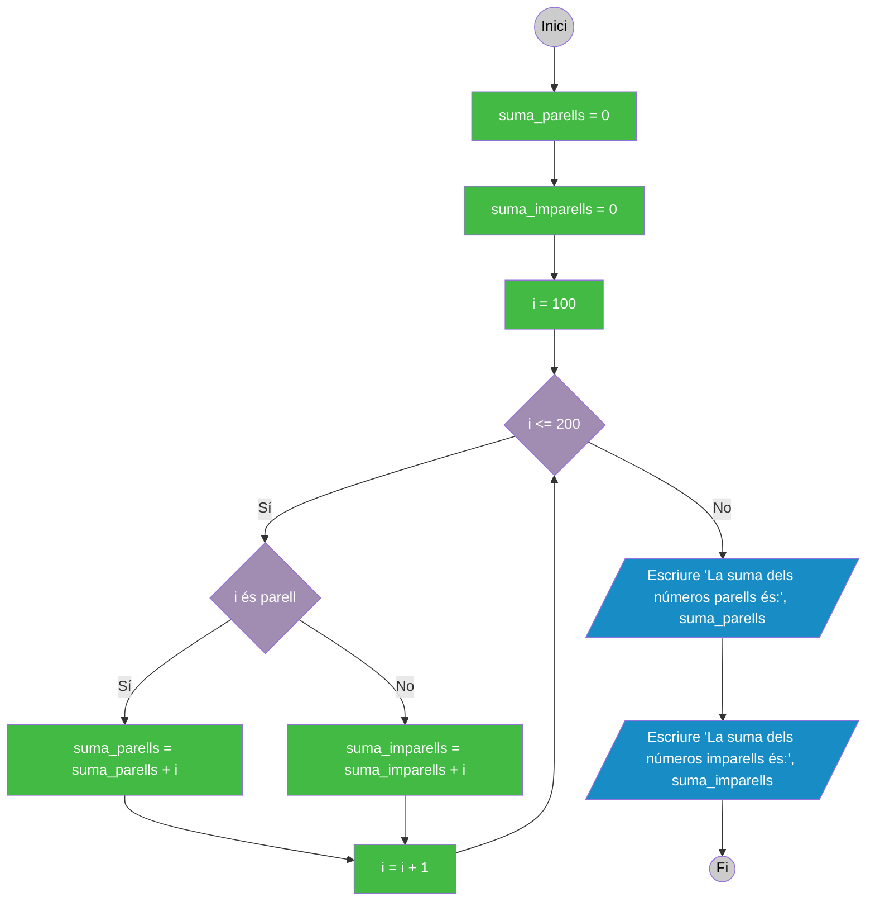
```mermaid
graph TD
    A((Inici)) --> B[suma_parells = 0]
    B --> C[suma_imparells = 0]
    C --> D[i = 100]
    D --> E{i <= 200}
    E -->|Sí| F{i és parell}
    F -->|Sí| G[suma_parells = suma_parells + i]
    F -->|No| H[suma_imparells = suma_imparells + i]
    G --> I[i = i + 1]
    H --> I
    I --> E
    E -->|No| J[/Escriure 'La suma dels números parells és:', suma_parells/]
    J --> K[/Escriure 'La suma dels números imparells és:', suma_imparells/]
    K --> L((Fi))

    classDef romboide fill:#188CC4, color:white;
    classDef rombo fill:#A08DB1, color:white;
    classDef rectangle fill:#43BA43, color:white;
    classDef inici_fi fill:#ccc, color:#000;
    class J,K romboide
    class B,C,D,G,H,I rectangle
    class E,F rombo
    class A,L inici_fi

```

---

## Exercici 17

L'institut Càlcul i Matemàtiques Avançades requereix un programa que permeti elevar un número real A a un exponent enter B sense utilitzar l'operador de potència. Això és important en situacions on es desitgen realitzar càlculs matemàtics més controlats en aplicacions específiques. Ambdós números seran introduïts per l'usuari.

```pseudocódigo
Inici
    Escriure "Introduïu la base A:"
    Llegir A
    Escriure "Introduïu l'exponent B:"
    Llegir B
    resultat ← 1
    Per i des de 1 fins a B fer
        resultat ← resultat * A
    FiPer
    Escriure A, "elevat a", B, "és:", resultat
Fi
```

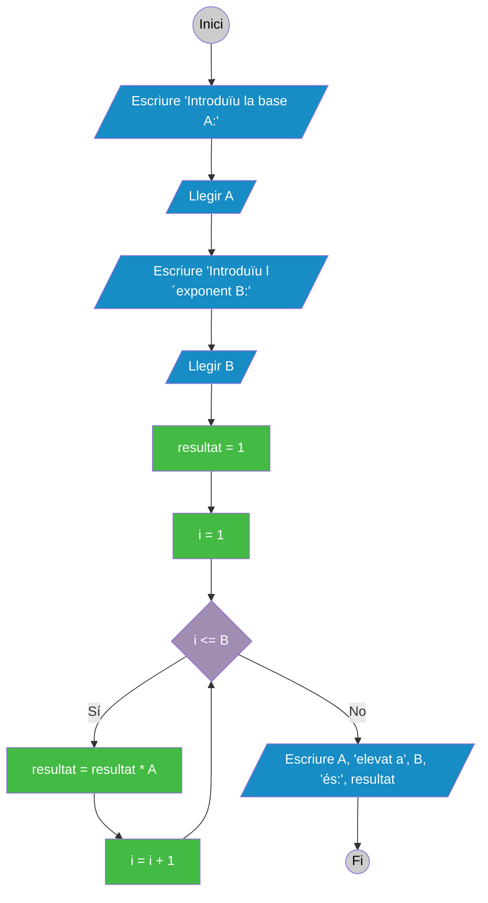
```mermaid
graph TD
    A((Inici)) --> B[/Escriure 'Introduïu la base A:'/]
    B --> C[/Llegir A/]
    C --> D[/Escriure 'Introduïu l´exponent B:'/]
    D --> E[/Llegir B/]
    E --> F[resultat = 1]
    F --> G[i = 1]
    G --> H{i <= B}
    H -->|Sí| I[resultat = resultat * A]
    I --> J[i = i + 1]
    J --> H
    H -->|No| K[/Escriure A, 'elevat a', B, 'és:', resultat/]
    K --> L((Fi))

    classDef romboide fill:#188CC4, color:white;
    classDef rombo fill:#A08DB1, color:white;
    classDef rectangle fill:#43BA43, color:white;
    classDef inici_fi fill:#ccc, color:#000;
    class B,C,D,E,K romboide
    class F,G,I,J rectangle
    class H rombo
    class A,L inici_fi
```

---

## Exercici 18

El club de recreació Jocs Mentals ha sol·licitat un programa que permeti simular el joc "Adivina el número". En aquest joc, l'usuari pensa en un número del 1 al 100 i l'ordinador intentarà endevinar el número, demanant retroalimentació a l'usuari sobre si el número proposat és major, menor o igual al número pensat.

```pseudocódigo
Inici
    menor ← 1
    major ← 100
    endevinat ← fals
    Mentres endevinat ← fals fer
        proposta ← (menor + major) / 2
        Escriure "El número és", proposta, "? (Escriure major, menor o igual)"
        Llegir resposta
        Si resposta ← "major" llavors
            menor ← proposta + 1
        Sinó si resposta ← "menor" llavors
            major ← proposta - 1
        Sinó
            endevinat ← vertader
        FiSi
    FiMentres
    Escriure "¡El número és", proposta, "!"
Fi
```

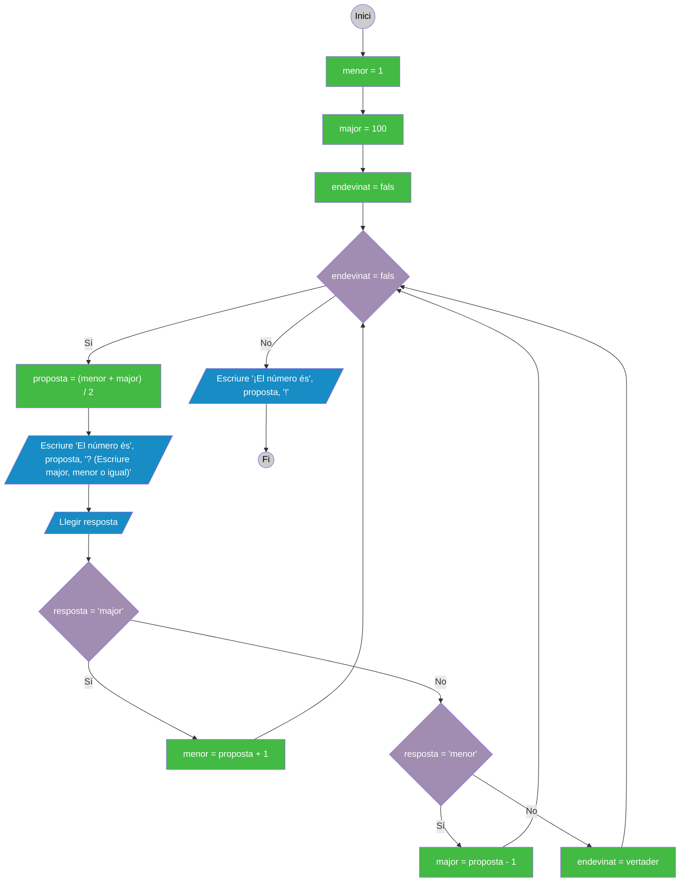
```mermaid
graph TD
    A((Inici)) --> B[menor = 1]
    B --> C[major = 100]
    C --> D[endevinat = fals]
    D --> E{endevinat = fals}
    E -->|Sí| F["proposta = (menor + major) / 2"]
    F --> G[/"Escriure 'El número és', proposta, '? (Escriure major, menor o igual)'"/]
    G --> H[/Llegir resposta/]
    H --> I{resposta = 'major'}
    I -->|Sí| J[menor = proposta + 1]
    I -->|No| K{resposta = 'menor'}
    K -->|Sí| L[major = proposta - 1]
    K -->|No| M[endevinat = vertader]
    J --> E
    L --> E
    M --> E
    E -->|No| N[/Escriure '¡El número és', proposta, '!'/]
    N --> O((Fi))

    classDef romboide fill:#188CC4, color:white;
    classDef rombo fill:#A08DB1, color:white;
    classDef rectangle fill:#43BA43, color:white;
    classDef inici_fi fill:#ccc, color:#000;
    class G,H,N romboide
    class B,C,D,F,J,L,M rectangle
    class E,I,K rombo
    class A,O inici_fi

```

---

## Exercici 19

Un banc ha sol·licitat un programa que, donada una quantitat d'euros introduïda per teclat (múltiple de 5), mostrarà quins bitllets seran necessaris per aconseguir aquesta quantitat (bitllets de 500, 200, 100, 50, 20, 10 i 5 euros). El programa ha de calcular el mínim nombre de bitllets possible.
Per exemple: si l'usuari introdueix 145 €, el programa indicarà que seran necessaris 1 bitllet de 100 €, 2 bitllets de 20 € i 1 bitllet de 5 €.

```pseudocódigo
Inici
    Escriure "Introduïu la quantitat en euros (múltiplo de 5):"
    Llegir quantitat
    bitllets500 ← quantitat // 500
    quantitat ← quantitat % 500
    bitllets200 ← quantitat // 200
    quantitat ← quantitat % 200
    bitllets100 ← quantitat // 100
    quantitat ← quantitat % 100
    bitllets50 ← quantitat // 50
    quantitat ← quantitat % 50
    bitllets20 ← quantitat // 20
    quantitat ← quantitat % 20
    bitllets10 ← quantitat // 10
    quantitat ← quantitat % 10
    bitllets5 ← quantitat // 5
    Escriure "Bitllets de 500:", bitllets500
    Escriure "Bitllets de 200:", bitllets200
    Escriure "Bitllets de 100:", bitllets100
    Escriure "Bitllets de 50:", bitllets50
    Escriure "Bitllets de 20:", bitllets20
    Escriure "Bitllets de 10:", bitllets10
    Escriure "Bitllets de 5:", bitllets5
Fi
```

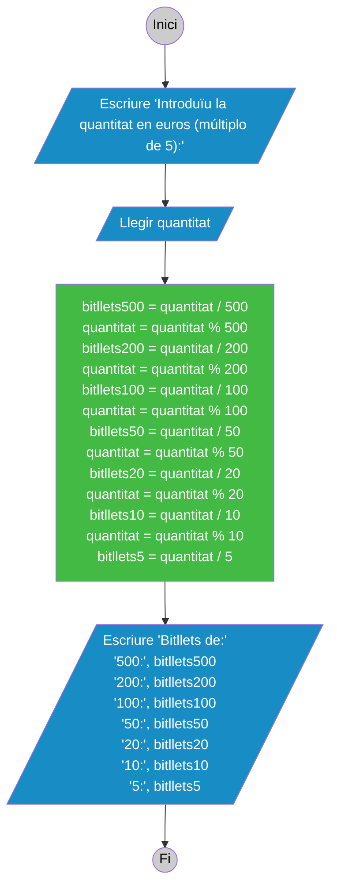
```mermaid
graph TD
    A((Inici)) --> B[/"Escriure 'Introduïu la quantitat en euros (múltiplo de 5):'"/]
    B --> C[/Llegir quantitat/]
    C --> D[ 
    bitllets500 = quantitat / 500
    quantitat = quantitat % 500
    bitllets200 = quantitat / 200
    quantitat = quantitat % 200
    bitllets100 = quantitat / 100
    quantitat = quantitat % 100
    bitllets50 = quantitat / 50
    quantitat = quantitat % 50
    bitllets20 = quantitat / 20
    quantitat = quantitat % 20
    bitllets10 = quantitat / 10
    quantitat = quantitat % 10
    bitllets5 = quantitat / 5]
    D --> E[/Escriure 'Bitllets de:'
    '500:', bitllets500
    '200:', bitllets200
    '100:', bitllets100
    '50:', bitllets50
    '20:', bitllets20
    '10:', bitllets10
    '5:', bitllets5/]
    E --> F((Fi))

    classDef romboide fill:#188CC4, color:white;
    classDef rombo fill:#A08DB1, color:white;
    classDef rectangle fill:#43BA43, color:white;
    classDef inici_fi fill:#ccc, color:#000;
    class B,C,E romboide
    class D rectangle
    class A,F inici_fi

```

---

## Exercici 20

L'empresa de telecomunicacions "Trucades Fàcils" desitja implementar un sistema que calcule el cost d'una trucada telefònica en funció de la seva duració i tipus de trucada (local, nacional o internacional). L'usuari ha d'introduir la duració de la trucada en minuts i el tipus de trucada. El sistema ha de mostrar el cost total.

Tarifes:
Trucada local: 0,10 euros per minut.
Trucada nacional: 0,15 euros per minut.
Trucada internacional: 0,50 euros per minut.

```pseudocódigo
Inici
    Escriure "Introduïu la duració de la trucada en minuts:"
    Llegir duracio

    // Inicialitzem el cost
    cost ← 0

    // Repetir fins que s'introdueixi un tipus de trucada vàlid
    REPETIR
        Escriure "Seleccioneu el tipus de trucada: 1. Local 2. Nacional 3. Internacional"
        Llegir tipus

        // Determinar el cost segons el tipus de trucada
        Segons tipus Fer
            1:  // Trucada local
                cost ← duracio * 0,10
            2:  // Trucada nacional
                cost ← duracio * 0,15
            3:  // Trucada internacional
                cost ← duracio * 0,50
            D'Altra Manera:
                Escriure "Tipus de trucada no vàlid. Si us plau, torneu a introduir."
        Fi Segons
    FINS QUE tipus = 1 o tipus = 2 o tipus = 3

    // Mostrar el cost total
    Escriure "El cost total de la trucada és:", cost, "euros"
Fi

```

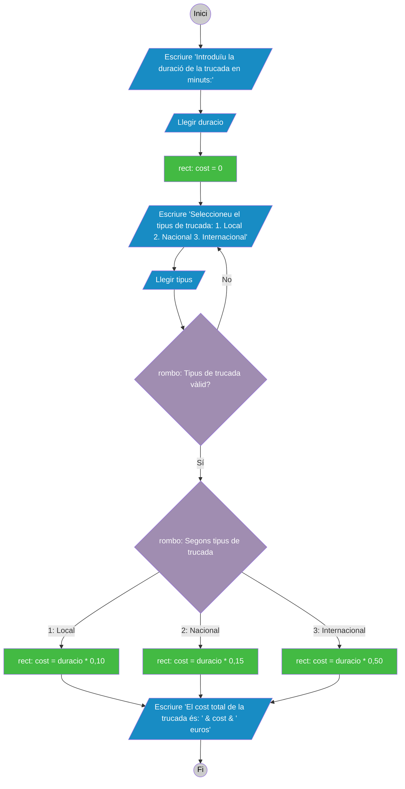
```mermaid
graph TD
    A((Inici)) --> B[/"Escriure 'Introduïu la duració de la trucada en minuts:'"/]
    B --> C[/Llegir duracio/]
    C --> D[rect: cost = 0]
    D --> F[/"Escriure 'Seleccioneu el tipus de trucada: 1. Local 2. Nacional 3. Internacional'"/]
    F --> G[/Llegir tipus/]
    G --> E{rombo: Tipus de trucada vàlid?}
    E -- "No" --> F
    
    

    E -- "Sí" --> H{rombo: Segons tipus de trucada}
    
    H -- "1: Local" --> I[rect: cost = duracio * 0,10]
    H -- "2: Nacional" --> J[rect: cost = duracio * 0,15]
    H -- "3: Internacional" --> K[rect: cost = duracio * 0,50]

    I --> L[/Escriure 'El cost total de la trucada és: ' & cost & ' euros'/]
    J --> L[/Escriure 'El cost total de la trucada és: ' & cost & ' euros'/]
    K --> L[/Escriure 'El cost total de la trucada és: ' & cost & ' euros'/]

    L --> M((Fi))

    classDef romboide fill:#188CC4, color:white;
    classDef rombo fill:#A08DB1, color:white;
    classDef rectangle fill:#43BA43, color:white;
    classDef inici_fi fill:#ccc, color:#000;

    class B,C,F,G,L romboide
    class D,I,J,K rectangle
    class E,H rombo
    class A,M inici_fi
```
